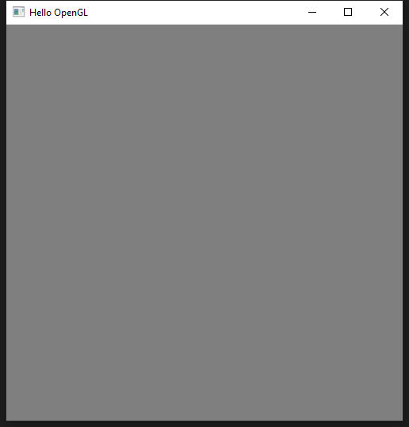

```
---
title: GCC with MinGW (+ OpenGL)
author: Junho Kim
date: 2023.03.20
---
```

# 소개

Windows 환경에서 네이티브 방식으로 GCC 개발환경을 구축하는 방법을 기술한다. 

Windows에서 Linux 스러운 개발환경을 구축하는 방법은 여러가지가 있다.
* Virtual Box, VMWare와 같은 가상환경을 사용하는 방법
* WSL2 (Windows Subsystem for Linux)를 이용하는 방법
* Windows native 방식으로 구축하는 방법

[mingw-w64](https://www.mingw-w64.org/)는 GCC와 LLVM과 같은 Linux 스러운 개발환경을 Windows native 방식으로 제공해 준다. mingw-w64를 직접 설치할 수도 있지만, Linux 스러운 쉘 환경을 제공해 주는 [MSYS2](https://www.msys2.org/)를 설치하고 그에 딸려 설치되는 mingw-w64를 이용하는 방식이 일반적이다. 


# MSYS2 설치

[MSYS2](https://www.msys2.org/) 는 Linux 스러운 윈도우 개발환경을 구축해 주는 소프트웨어이다. MSYS2를 설치하면 이와 함께 mingw-w64도 같이 설치된다.

MSYS2를 설치하면 `C:/msys64/`라는 디렉토리가 생기는데, 이 디렉토리 아래에 조그만 Linux 환경이 설치된다고 보면 된다. 

* [MSYS2](https://www.msys2.org/) 홈페이지에서 다운로드 받은 후 설치한다. 
	* 본 문서는 `msys2-x86_64-20230318.exe` 파일로 설치한 MSYS2를 기준으로 작성되었다.
	* 본 문서는 MSYS2 설치 폴더를 `C:\msys64`로 설정하여 설치했다 가정한다.
* MSYS2 UCRT64 버젼의 쉘 사용을 권장한다.
	* 시작 > MSYS2 UCRT64 클릭
	* UCRT (Universial C Runtime)는 MSVCRT (Microsoft Visual C++ Runtime)에 비해 보다 향상된 호환성을 가지고 있다. 
	* UCRT64 쉘을 이용해 설치한 패키지들은 `C:\msys64\ucrt64` 디렉토리 아래 설치된다.
* MSVCRT와 UCRT의 차이에 대한 설명은 [MSVCRT vs UCRT](https://www.msys2.org/docs/environments/#msvcrt-vs-ucrt)을 참조한다.

MSYS2 쉘은 기본적으로 `C:\msys64\home\{username}\`를 홈 디렉토리, 즉 `cd ~` 로 사용한다.
* MSYS2를 언인스톨하면 홈 디렉토리도 제거된다.
* 쉘에서 사용자가 만든 파일은 기본적으로 홈 디렉토리 아래에 놓이기 때문에, MSYS2를 언인스톨할 일이 있다면 홈 디렉토리 아래의 파일들을 백업해 놓길 바란다.


## Windows Terminal로 쉘 이용하기 (option)

MSYS2 쉘 환경은 기본적으로 제공해 주는 터미널인 MSYS2 UCRT64(시작 버튼 > MSYS2 UCRT64 클릭)를 사용할 수도 있지만, 좀 더 편리한 터미널인 Windows Terminal을 통해 MSYS2 쉘 환경을 사용할 수도 있다.

Windows Terminal에서 MSYS2 쉘을 쓰려면 [MSYS2 > Documentation > Terminals](https://www.msys2.org/docs/terminals/) 를 참고하자. Windows Terminal은 Microsoft Store에서 다운로드 받을 수 있다.

Windows Terminal을 시작한 다음, (설정 > 새 프로필 추가 > 새 빈 프로필) 클릭 후, 다음과 같이 설정하면 Windows Terminal에서도 MSYS2를 사용할 수 있다.
* 이름: MSYS2
* 명령줄: C:/msys64/msys2_shell.cmd -defterm -here -no-start -ucrt64
* 시작 디렉토리: C:/msys64/home/%USERNAME%
* 아이콘: C:/msys64/ucrt64.ico 


## 패키지 설치

[MSYS2 패키지](https://packages.msys2.org/package/)를 참조하여 필요한 패키지를 설치하도록 한다. 여기서는 UCRT 기반의 패키지 설치를 권장한다. 

MSYS2는 Ubuntu가 쓰는 `apt` 패키지 관리 툴이 아닌 Arch Linux가 쓰는 `pacman` 패키지 관리 툴을 사용한다.  


### GCC 개발환경 구축 설치

쉘에 다음 명령어를 입력하여 개발환경을 설치한다.

```shell
pacman -S --needed base-devel mingw-w64-ucrt-x86_64-toolchain
```

개발환경 설치가 잘 되었는지 확인해 보자

```shell
gcc --version
g++ --version
gdb --version
```

### 패키지 업데이트

업데이트된 패키지가 있으면 반영하도록 한다.
* 업데이트 중 쉘을 강제 종료시키는 경우가 있는데, 이 경우 쉘을 재구동시킨 후 업데이트를 한번 더 수행한다.
* 종종 수행해서 패키지를 최신 상태로 만들어 두자.

```shell
pacman -Syyu
```


### 각종 유틸리티 설치

git, neovim, cmake 등 각종 유틸리티를 설치하자.

```shell
pacman -S git 
pacman -S mingw-w64-ucrt-x86_64-neovim   # nvim
pacman -S mingw-w64-ucrt-x86_64-cmake    # cmake
```

유틸리티 설치가 잘 되었는지 확인해 보자

```shell
git --version
nvim --version
cmake --version
```


### OpenGL 개발환경 설치 (glew, glfw, glm)

OpenGL 프로그래밍을 위한 라이브러리도 다음과 같이 설치한다.

```shell
pacman -S mingw-w64-ucrt-x86_64-glew
pacman -S mingw-w64-ucrt-x86_64-glfw
pacman -S mingw-w64-ucrt-x86_64-glm
```


# Hello World with g++

에디터(nano나 nvim 등)을 이용해 
1) 아래와 같이 `main.cpp`를 구성한 후,

```c++
#include <iostream>

int main(int argc, char* argv[])
{
	std::cout << "Hello World" << std::endl;

	return 0;
}
```

2) 아래의 Makefile 파일을 작성하고,

```Makefile
all:
	g++ main.cpp
```

3) 쉘에서 다음과 같이 컴파일 해 보자.

```shell
make
```

4) 쉘에서 다음과 같이 실행시켜 보자.

```shell
./a.exe
```

아래와 같이 Hello World 메시지가 터미널에서 나오면 된다.

```shell
Hello World
```


쉘에서 `ls` 명령어를 통해 `a.exe` 파일이 현재 디렉토리 밑에 생성된 것을 볼 수 있다. 이는 Windows native 개발이 가능한 GCC를 썼기 때문에 윈도우에서 실행가능한 `a.exe` 파일이 나왔다는 점을 주목하자.

정리하면 다음과 같다.
* [mingw-w64](https://www.mingw-w64.org/)에서 제공하는 GCC 개발환경으로 Windows native 코드를 개발하였다.
* Linux에서 개발한 경우 `a.out` 파일이 실행 파일로 나오는 것과는 달리 `a.exe` 파일이 나왔다.
	* 당연하게도 `a.exe` 파일은 Windows 실행가능 파일이다.
	* 해당 파일은 Ubuntu 실행가능 파일이 아니기 때문에 `a.exe`를 Ubuntu에 복사해서 실행시키려고 해도 Ubuntu에서는 실행되지 않는다. 

이런 식으로 굳이  [mingw-w64](https://www.mingw-w64.org/)의 GCC 개발환경을 쓰는 이유는 다음과 같다. 
* Linux로 개발된 *소스 코드*가 있다면, 1) 이를 다운받은 후, 2) `Makefile`을 파일을  조금 수정해 컴파일 하면, 3) Windows에서 돌아가는 *실행 파일*을 만들 수 있다.
* Windows에서 [mingw-w64](https://www.mingw-w64.org/)의 GCC로 개발한 *소스 코드*가 있다면, 1) 동일 코드를 Ubuntu와 같은 Linux 환경에 가져간 다음, 2) `Makefile`을 조금 수정해 컴파일 하면, 3) Linux에서 돌아가는 *실행 파일*을 만들 수 있다.

 즉, 소스 코드의 수정이 필요 없는 크로스 플랫폼 개발을 위해 이러한 방식을 사용한다.
 

# OpenGL 프로젝트 테스트

이제 Windows native 환경에서 GCC를 써서 OpenGL을 개발해 보도록 하자. 

다음과 같이 GLEW + GLFW3를 이용한 OpenGL 프로그램을 작성한다.

```cpp
///// main.cpp
///// OpenGL 3+, GLEW, GLFW3

#include <GL/glew.h>
#include <GLFW/glfw3.h>

#include <iostream>

int main(void)
{
  GLFWwindow* window;

  // Initialize GLFW library
  if (!glfwInit())
    return -1;

  // Create a GLFW window containing a OpenGL context
  window = glfwCreateWindow(500, 500, "Hello OpenGL", NULL, NULL);
  if (!window)
  {
    glfwTerminate();
    return -1;
  }

  // Make the current OpenGL context as one in the window
  glfwMakeContextCurrent(window);

  // Initialize GLEW library
  if (glewInit() != GLEW_OK)
    std::cout << "GLEW Init Error!" << std::endl;

  // Print out the OpenGL version supported by the graphics card in my PC
  std::cout << glGetString(GL_VERSION) << std::endl;

  // Init OpenGL
  glEnable(GL_DEPTH_TEST);
  glEnable(GL_CULL_FACE);
  glClearColor(0.5, 0.5, 0.5, 1.0);


  // Loop until the user closes the window
  while (!glfwWindowShouldClose(window))
  {
    // Render here
    glClear(GL_COLOR_BUFFER_BIT | GL_DEPTH_BUFFER_BIT);

    // Swap front and back buffers
    glfwSwapBuffers(window);

    // Poll for and process events
    glfwPollEvents();
  }

  glfwTerminate();

  return 0;
}
```


## Makefile 작성

MSYS2 디렉토리 구조나 파일명이 Linux 환경과 조금 다르기 때문에 Linux용 `Makefile`이 아닌 다음과 같은 `Makefile.mingw` 파일을 작성하도록 하자.
* MSYS2의 include, lib 디렉토리 위치를 컴파일러가 인지할 수 있도록 `Makefile.mingw` 파일에 명시한다.
* MSYS2의 라이브러리 파일명이 리눅스 환경과 다르기 때문에 라이브러리 파일 링크 부분도 이에 맞게 수정한다.

```Makefile
# Directories containing C headers
INCLUDE_DIRS = -I"C:\msys64\ucrt64\include"
# Directoreis containing import libraries. 
LIB_DIRS = -L"C:\msys64\ucrt64\lib"
LDFLAGS = -lopengl32 -lglew32 -lglfw3 ${LIB_DIRS}

all:
	g++ -std=c++11 main.cpp -o hello ${LDFLAGS}
```

`make` 명령어로 `Makefile.mingw`를 이용해 프로그램을 빌드해 본다.

```shell
make -f Makefile.mingw
```

빌드가 성공적으로 수행되었다면, 다음을 쉘에서 수행해 보자.

```shell
./hello.exe
```

아래와 같이 회색 OpenGL 창이 뜨면 정상이다.  



`make` 명령어로 빌드를 수행할 때 에러가 발생한다면 다음을 의심해 보도록 하자.
* MSYS2 설치 디렉토리가 `C:/msys64`가 아닌 경우, 자신의 설치 경로를 `Makefile.mingw`에 반영한다.
* OpenGL 개발환경이 제대로 설치되었는지 확인하자.


## Assimp 설치

그래픽스 프로젝트 중 [assimp](https://github.com/assimp/assimp)를 이용하는 경우가 있다. mingw-w64에서 아래와 같은 방법으로 assimp 패키지를 깔도록 한다. 

```shell
pacman -S mingw-w64-ucrt-x86_64-assimp
```


# 레퍼런스

* [MSYS2 - GCC/MinGW on Windows (C/C++ Development)](https://youtu.be/KHWlz1GnFJU)
* [Using GCC with MinGW](https://code.visualstudio.com/docs/cpp/config-mingw)
